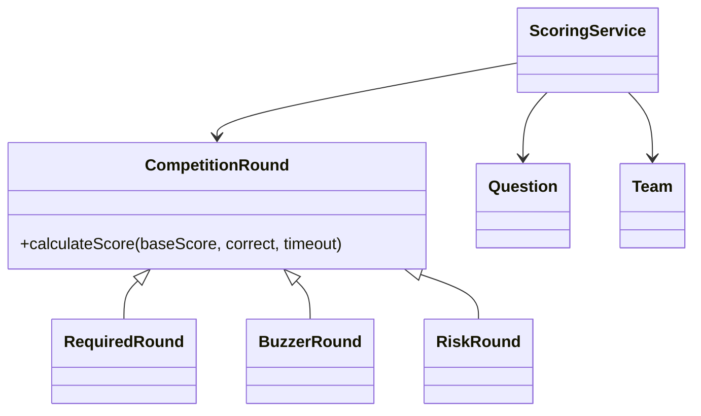

# 航空知识竞赛管理系统

面向对象课程设计第 41 题，作者：喻雪勇。系统以 JavaFX 构建桌面界面，使用 SQLite 持久化数据，支持题库管理、多轮计时计分、实时排名、晋级判定和成绩单导出。

## 技术栈

- JDK 21
- JavaFX 21
- Maven
- SQLite JDBC
- JUnit 5

## 运行

```shell
mvn clean test
mvn javafx:run
```

首次启动会自动创建 `data/aviation_quiz.db` 并写入演示题目，不需要安装 MySQL。

## 核心设计

三类轮次继承 `CompetitionRound`，并各自实现计分规则：



数据库表按第三范式拆分为题目分类、题目、选项、竞赛、选手、队伍、成员关系、轮次、轮次题目、作答记录和最终成绩。完整建表语句位于 `src/main/resources/database/schema.sql`。

## 计分和排名

- 必答题：答对加基础分，答错或超时不扣分。
- 抢答题：答对加基础分，答错或超时扣基础分。
- 风险题：按风险倍数加分或扣分。
- 排名：总分降序、答对数降序、累计用时升序、队伍编号升序。

## 数据文件

- SQLite 数据库：`data/aviation_quiz.db`
- 成绩单：在实时排名页面导出 UTF-8 CSV 文件

课程设计报告须由学生本人撰写，本仓库不包含由 AI 生成的课程设计报告。
