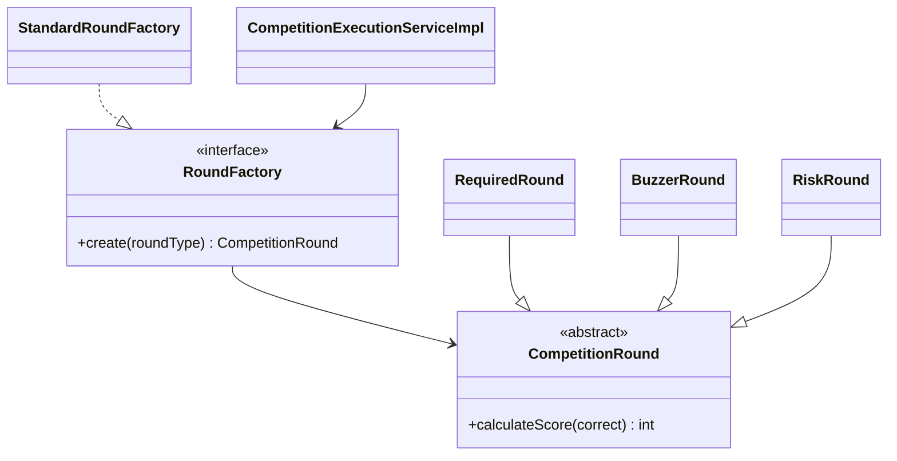

# 核心功能分层设计与执行过程

> 本文只描述当前源码中已经实现并通过测试的结构，不代替课程设计报告。答辩前应结合源码逐个断点验证，并用自己的语言说明设计取舍。

## 1. 分层边界

当前优先完成了六个核心业务闭环：账号与资料、竞赛配置、题库与轮次题单、选手提交答案、报名与分组、排名与归档。它们遵循统一的依赖方向：

`View → Controller → Service 接口 → Service 实现 → DAO 接口 → JDBC DAO → SQLite`

| 层 | 当前类 | 职责 |
|---|---|---|
| View | `QuizWindows` | 读取控件值、展示结果和错误，不写 SQL、不计算得分 |
| Controller | `AccountController`、`CompetitionManagementController`、`QuestionBankController`、`CompetitionRoomController`、`RegistrationController`、`ResultController` | 检查页面输入是否缺失，调用用例接口 |
| 用例接口 | `AccountUseCases`、`CompetitionManagementUseCases`、`QuestionBankUseCases`、`CompetitionRoomService`、`RegistrationUseCases`、`ResultUseCases` | 定义 View 可以发起的系统操作 |
| 门面服务 | `QuizService` | 验证会话和角色，把核心规则委托给领域服务 |
| 领域服务 | `AccountManagementServiceImpl`、`CompetitionManagementServiceImpl`、`QuestionBankServiceImpl`、`CompetitionExecutionServiceImpl`、`RegistrationManagementServiceImpl`、`ResultServiceImpl` | 执行业务规则、控制事务用例 |
| DAO 接口 | `AccountDao`、`CompetitionDao`、`QuestionBankDao`、`GameDao`、`RegistrationDao`、`ResultDao` | 隔离业务规则与 JDBC/SQLite |
| DAO 实现 | `JdbcAccountDao`、`JdbcCompetitionDao`、`JdbcQuestionBankDao`、`JdbcGameDao`、`JdbcRegistrationDao`、`JdbcResultDao` | 查询、保存并映射数据库记录 |
| Entity | `CompetitionRound` 及子类、各类 Context/Record | 表达业务对象和跨层不可变数据 |
| 组装入口 | `AppContext` | 只在程序入口创建实现类并注入接口依赖 |

竞赛综合列表查询与现场运行控制仍有部分由 `QuizService` 直接访问 `Store`，属于后续拆分范围；因此不能宣称整个系统已经全部完成 DAO 分层。

## 2. 核心类结构

```mermaid
classDiagram
    class QuizWindows
    class AccountController
    class CompetitionManagementController
    class QuestionBankController
    class CompetitionRoomController
    class RegistrationController
    class ResultController

    class AccountUseCases { <<interface>> }
    class CompetitionManagementUseCases { <<interface>> }
    class QuestionBankUseCases { <<interface>> }
    class CompetitionRoomService { <<interface>> }
    class RegistrationUseCases { <<interface>> }
    class ResultUseCases { <<interface>> }
    class QuizService

    class AccountManagementService { <<interface>> }
    class CompetitionManagementService { <<interface>> }
    class QuestionBankService { <<interface>> }
    class CompetitionExecutionService { <<interface>> }
    class RegistrationManagementService { <<interface>> }
    class ResultService { <<interface>> }
    class AccountManagementServiceImpl
    class CompetitionManagementServiceImpl
    class QuestionBankServiceImpl
    class CompetitionExecutionServiceImpl
    class RegistrationManagementServiceImpl
    class ResultServiceImpl

    class AccountDao { <<interface>> }
    class CompetitionDao { <<interface>> }
    class QuestionBankDao { <<interface>> }
    class GameDao { <<interface>> }
    class RegistrationDao { <<interface>> }
    class ResultDao { <<interface>> }
    class JdbcAccountDao
    class JdbcCompetitionDao
    class JdbcQuestionBankDao
    class JdbcGameDao
    class JdbcRegistrationDao
    class JdbcResultDao

    QuizWindows --> AccountController
    QuizWindows --> CompetitionManagementController
    QuizWindows --> QuestionBankController
    QuizWindows --> CompetitionRoomController
    QuizWindows --> RegistrationController
    QuizWindows --> ResultController
    AccountController --> AccountUseCases
    CompetitionManagementController --> CompetitionManagementUseCases
    QuestionBankController --> QuestionBankUseCases
    CompetitionRoomController --> CompetitionRoomService
    RegistrationController --> RegistrationUseCases
    ResultController --> ResultUseCases
    QuizService ..|> AccountUseCases
    QuizService ..|> CompetitionManagementUseCases
    QuizService ..|> QuestionBankUseCases
    QuizService ..|> CompetitionRoomService
    QuizService ..|> RegistrationUseCases
    QuizService ..|> ResultUseCases
    QuizService --> AccountManagementService
    QuizService --> CompetitionManagementService
    QuizService --> QuestionBankService
    QuizService --> CompetitionExecutionService
    QuizService --> RegistrationManagementService
    QuizService --> ResultService
    AccountManagementServiceImpl ..|> AccountManagementService
    CompetitionManagementServiceImpl ..|> CompetitionManagementService
    QuestionBankServiceImpl ..|> QuestionBankService
    CompetitionExecutionServiceImpl ..|> CompetitionExecutionService
    RegistrationManagementServiceImpl ..|> RegistrationManagementService
    ResultServiceImpl ..|> ResultService
    AccountManagementServiceImpl --> AccountDao
    CompetitionManagementServiceImpl --> CompetitionDao
    QuestionBankServiceImpl --> QuestionBankDao
    CompetitionExecutionServiceImpl --> GameDao
    RegistrationManagementServiceImpl --> RegistrationDao
    ResultServiceImpl --> ResultDao
    JdbcAccountDao ..|> AccountDao
    JdbcCompetitionDao ..|> CompetitionDao
    JdbcQuestionBankDao ..|> QuestionBankDao
    JdbcGameDao ..|> GameDao
    JdbcRegistrationDao ..|> RegistrationDao
    JdbcResultDao ..|> ResultDao
```

计分扩展结构：

## 3. 功能执行过程

### 3.1 选手提交答案

1. `QuizWindows` 取得当前发布编号和 A/B/C/D 选项，调用 `CompetitionRoomController.submitAnswer`。
2. Controller 拒绝空发布编号或空选项，再调用 `CompetitionRoomService.submit`。
3. `QuizService.submit` 验证选手会话并执行超时恢复，然后把选手编号交给 `CompetitionExecutionService`。
4. `CompetitionExecutionServiceImpl` 在 `GameDao.inTransaction` 内读取 `AnswerSubmissionContext`，校验比赛状态、截止时间、分组资格和重复提交。
5. 服务通过 `RoundFactory` 得到具体 `CompetitionRound`，以多态方法 `calculateScore` 判分。
6. 服务构造不可变 `AnswerRecord`，由 `GameDao.saveAnswer` 保存；JDBC 细节只存在于 `JdbcGameDao`。
7. 得分逐层返回 View，View 更新“回答正确/错误”和分数提示。

### 3.2 选手报名与工作人员分组

1. `QuizWindows` 根据按钮动作调用 `RegistrationController.join/cancel/addGroup/assign`。
2. Controller 检查竞赛、小组或报名编号以及组名等页面输入。
3. `QuizService` 按用例验证选手或工作人员身份，将预约/报名布尔值转换为 `ParticipationType`。
4. `RegistrationManagementServiceImpl` 校验竞赛状态、报名时间、资料完整性、重复记录、分组归属等业务规则。
5. `RegistrationDao` 在同一事务中恢复原记录或写入新记录；正式报名时同步取消有效预约。
6. 成功返回后 View 刷新竞赛状态、名单或小组列表；业务异常统一显示给用户。

### 3.3 排名、晋级预览与归档

1. `QuizWindows` 调用 `ResultController.ranking/preview/archive/exportCsv`。
2. Controller 先检查是否选择竞赛，再调用 `ResultUseCases`。
3. `QuizService` 验证登录状态或工作人员权限，并委托 `ResultService`。
4. `ResultServiceImpl` 从 `ResultDao` 取得 `RankingSnapshot`，按总分、答对数、用时和选手编号稳定排序。
5. 预览会先确认全部轮次完成；归档在一个事务中再次检查状态，保存每名选手的最终分、名次和晋级标记，最后更新竞赛状态。
6. View 展示列表；CSV 导出复用同一排名结果，避免页面排名与文件排名不一致。

### 3.4 账号注册、登录与资料维护

1. `QuizWindows` 调用 `AccountController` 完成工作人员初始化、选手注册、登录、退出和资料维护。
2. Controller 检查空账号、空密码及两次密码是否一致，通过 `AccountUseCases` 调用系统用例。
3. `QuizService` 在登录成功后创建或复用 `Session`，在资料操作前验证会话身份；密码与资料规则委托给 `AccountManagementService`。
4. `AccountManagementServiceImpl` 校验账号长度、密码长度、手机号、学号格式及“院校 + 学号”唯一性，并完成 PBKDF2 哈希或密码验证。
5. `AccountDao` 负责账号和资料事务，`JdbcAccountDao` 执行 SQLite 查询与保存；返回 View 的是 `PlayerProfileView`，不是数据库 `Row`。

### 3.5 新建/编辑竞赛与报名状态流转

1. `QuizWindows` 将表单转换为 `CompetitionInput`，调用 `CompetitionManagementController.save`；开放或截止报名时调用 `changeRegistrationState`。
2. Controller 检查竞赛输入、竞赛编号和目标状态是否缺失，再调用 `CompetitionManagementUseCases`。
3. `QuizService` 验证工作人员会话，随后委托 `CompetitionManagementService`。
4. `CompetitionManagementServiceImpl` 校验名称、简介、时间顺序、晋级名额和分类；编辑时阻止删除题单仍在使用的分类。
5. 状态流转只允许“未开放 → 报名中 → 报名截止”，并以注入的 `Clock` 检查报名开始与截止时间。
6. `CompetitionDao` 在同一事务中保存竞赛与分类，`JdbcCompetitionDao` 封装所有相关 SQL。

### 3.6 题库、轮次与题单配置

1. `QuizWindows` 调用 `QuestionBankController` 查询或维护题目、轮次和轮次题单，不再直接调用完整的 `QuizService`。
2. Controller 检查竞赛、题目、轮次及题单编号等页面输入，通过 `QuestionBankUseCases` 发起操作。
3. `QuizService` 只验证工作人员会话，随后委托 `QuestionBankService`。
4. `QuestionBankServiceImpl` 校验三类知识分类、四个非空选项、标准答案、题目引用锁定、轮次顺序与时限。
5. 新增或修改轮次时通过 `RoundFactory` 验证并创建多态计分规则；添加题目时检查启用状态、竞赛分类及同场不重复用题。
6. `QuestionBankDao` 在事务中完成读写，`JdbcQuestionBankDao` 封装 SQL；查询向上返回 `QuestionView`、`RoundView`、`RoundQuestionView`，不会把数据库 `Row` 泄漏给 View。

## 4. 扩展性如何体现

- **继承与多态**：`RequiredRound`、`BuzzerRound`、`RiskRound` 继承抽象类 `CompetitionRound`，比赛执行服务只调用抽象方法，不写三套判分分支。
- **接口隔离**：各 Controller 分别依赖小接口，而不是依赖全部 `QuizService` 方法；领域服务依赖 DAO 接口，不依赖 `Store` 或 JDBC 实现。
- **工厂与开闭原则**：`RoundFactory` 隔离“类型字符串如何得到计分对象”。`StandardRoundFactory` 使用规则注册表；新增规则可注入新的创建器，无须修改 `CompetitionExecutionServiceImpl`。
- **依赖注入**：`AppContext` 是唯一组装入口。测试可替换 DAO 或 `RoundFactory`，不需要 JavaFX 或真实数据库。
- **不可变跨层数据**：Context、Record、Snapshot 使用 record 表达，减少 DAO 行对象泄漏到业务规则。
- **异常分层**：规则失败抛出 `BusinessException`，数据库失败转换为 `DataAccessException`，View 不解析 SQLException。

## 5. 可验证证据

- `CompetitionExecutionServiceTest`：证明答案校验、保存以及自定义计分工厂可替换。
- `AccountControllerTest`、`AccountManagementServiceTest`：证明账号界面委托、密码哈希认证及资料唯一性规则。
- `CompetitionManagementControllerTest`、`CompetitionManagementServiceTest`：证明竞赛表单委托、分类约束和状态时间窗口。
- `QuestionBankControllerTest`、`QuestionBankServiceTest`：证明题库与题单委托、类型化查询、引用锁定、多态轮次和重复用题约束。
- `StandardRoundFactoryTest`：证明三种现有规则和新增 BONUS 规则均通过统一接口创建。
- `RegistrationControllerTest`、`ResultControllerTest`：证明 Controller 只处理输入并委托接口。
- `ResultServiceTest`：证明稳定排序、未完成轮次拦截和归档事务。
- `QuizWindowsTest`：使用临时 SQLite 数据库验证界面主流程与小组数据隔离。

当前完整命令 `mvn -Dquiz.uiTest=true clean test package` 共通过 53 项测试。
